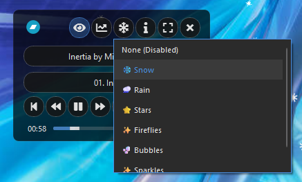
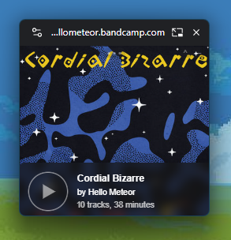

#  Beni's Bandcamp Player

**Compact, Fully featured Bandcamp Streaming App for Windows 10/11.**

Preview Bandcamp releases quickly and conveniently before purchasing (**Note:** This app plays Bandcamp’s free 128kbps streams - support the artists to get full-quality downloads for your favorite music player like MusicBee, foobar2000, VLC, etc).

**Legal:** This app is Free proprietary software - not open source. Compiled releases only. No source distribution. GitHub is used for releases and issue tracking.

  

[Key Features](#key-features) &nbsp;&middot;&nbsp; [Quick Start](#quick-start) &nbsp;&middot;&nbsp; [Troubleshooting](#troubleshooting) &nbsp;&middot;&nbsp; [Disclaimer](#legal--ethical-use)

 

*The main player regular/mini/micro/nano modes and notification.*

*The image viewer mode with player, playlist, visualizer and particles effects available.*

*The image viewer interface in fullscreen mode with player, playlist, visualizer and particles effects available.*

## Key Features

* **Minimal design** - that stays out of your way with 3 modes to suit your style:
  * **Regular Mode** - main window that can be rolled up into Mini or Micro modes to save screen space.
  * **Nano Mode** - An ultra-compact dockable player that can snap to the top or bottom of your screen and auto-hide (à la Winamp); and
  * **Image Viewer Mode** - a lightbox-style showcase (great if you have a second monitor). Zoom and pan artwork, go fullscreen, and enjoy visualization/particle effects.  
* **Volume Control** - Adjustable volume!
* **Playlist Management** - Easily create and manage URLs and Save/Load separate lists.
* **Import URLs** - Easily Load Artist Discographies, Similar Artist or Import Collections. 
* **Shuffle & Repeat** - Multiple playback modes for varied listening.
* **App Themes** - Choose from Light, Dark, Album or Custom!
  * **Album Themes** - loads color palette from each URL for a unique look that matches the artists intent. Palettes can be saved and edited - with a Prefer Saved option to override the default palette! 
  * **Custom Themes** - Save an album theme you like or create your own with built in Theme editor!
* **Account Menu** - Login to Bandcamp to access **Follow Artist** and **Wishlist Album** features directly from the Apps Account Menu and unlock unlimited streaming of albums you've purchased with fancy icon and thank you messages. 
* **Track Change Notifications** - Keep track of what you are listening to, especially helpful in Nano Mode when autohidden; adjust the notifications or turn them off in the settings. 
* **Keyboard Shortcuts** - Full keyboard control for play, pause, next, previous, volume, and more (customizable in the settings menu). With Global Support. 

## Technology & Approach

Bandcamp doesn’t currently provide a public API for music playback, playlists, or track data (its official APIs are limited to sales and merchandise for artists and labels). 

Without a public playback API, Beni's Bandcamp Player instead relies on Bandcamp's native web pages, loading them in an embedded Chromium-based browser and provides a custom interface with added features such as enhanced playback controls, playlists, window modes, keyboard shortcuts, and more.

**Note:** Because the app loads the live Bandcamp website, account features like purchasing, wishlisting, and login work natively, and Bandcamp's standard listening limits apply.

### Core Stack

- **PySide6** – Cross-platform desktop framework for window management
- **PyQt6-WebEngine** – Embedded Chromium browser used to load Bandcamp’s site with full DOM access
- **Qt-Painted Interface** - Fully customizable Qt interface used for reliability and extensibility
- **QtAwesome** – FontAwesome icons for consistency across platforms
  
## Quick Start

**Installation**

1. Download and run [BenisBandcampPlayer-Setup-4.0.exe](https://github.com/bshurikan/Beni-BandcampPlayer/releases) and use the desktop or start menu shortcut to run (A portable .zip version is also available).
2. **Note:** You may see a Windows Defender SmartScreen Warning, see [Troubleshooting](#troubleshooting) for more information. 

## Usage

1. **Add URLs**: Drag and drop Bandcamp URLs into the main window (to load it right away) or into the playlist to create a queue (CTRL+V, Right click and select Paste URL also work).
3. **Play Music**: Double click on an album in the playlist to load the url and start playing.
4. **Player Controls**: Use the Play controls or keyboard shortcuts to navigate albums and tracks, and adjust play modes (see [Shuffle & Repeat Modes](#shuffle--repeat-modes--)).
6. **Album List**: Use the Album List to manage Bandcamp URL's, you can add/remove, reorder, load artist discography, save and load Album lists and more. The Album List can act as a sidebar (attached to the main window) or be detached for more flexibility (the detached Album List can be resized, docked to the main window and will remember its state/position)
7. **Window Modes**: Roll up the main window into Mini or Micro using the upward chevron or minimize to the separate Nano Player from the title bar.
8. **Image Viewer**: Click on the fullscreen button to enter Image viewer.
10. **Settings Menu**: Click on the cog icon to view several additional settings like Updates, Settings, Themes, and more. 

## Image Viewer (Fullscreen Cover Art with player)  

**Image Viewer Options:** toggle player autohide, visualizations*, particle effects and more. 

***Visualizations are simulated:** this app exclusively streams music via Bandcamp's embedded player, which does not provide safe, reliable access to the live audio data required for real-time spectrum analysis or waveforms. Instead, visualizations use playback-aware animation.

For true audio-reactive visualizations, please support the artist by purchasing and downloading the music from Bandcamp and playing it in a dedicated offline music player such as MusicBee, foobar2000, or VLC.

 

## Shuffle & Repeat Modes  

 **Shuffle Tracks** – shuffle tracks within the current album  
 **Shuffle Albums** – play albums in random order  
 **Super Shuffle** – completely random tracks and albums; avoids recent repeats  
 **Continuous Repeat** – plays through entire playlist (default)  
 **Repeat Album** – loops current album  
 **Repeat Track** – loops current track (shows "1" on button)  

**Combinations:** Shuffle and Repeat work together (e.g., *Shuffle Tracks + Repeat Album* loops shuffled tracks; *Super Shuffle + Repeat Off* plays random tracks without immediate repeats).

## Keyboard Shortcuts

* **Play/Pause** - Ctrl + Alt + Space
* **Next Track** - Ctrl + Alt + Right
* **Previous Track** - Ctrl + Alt + Left
* **Next Album** - Ctrl + Shift + Alt + Right
* **Previous Album** - Ctrl + Shift + Alt + Left
* **Volume Up** - Ctrl + Shift + Up
* **Volume Down** - Ctrl + Shift + Down
* **Mute** - Ctrl + Shift + M
* **Toggle Playlist** - Ctrl + Alt + P
* **Expand/Collapse Playlist** - Ctrl + Shift + Alt + P
* **Cycle App Mode** - Ctrl + Alt + M
* And more... (see Settings > Keyboard Shortcuts)

## Troubleshooting

**Please Note**
- Documentation is still improving
- This app has now received a decent amount of testing so it should be pretty stable but you may still encounter bugs, please feel free to report any issues or suggestions. Issues can usually be resolved by loading another url, restarting the app, or if you're really stuck renaming or deleting settings.json and it's Backup folder, and/or the Playlists folder. 

**Windows SmartScreen Warning**
- When you open the app for the first time, Windows might say: "Windows protected your PC"
- This happens because the app isn't code-signed. Code-signing certificates can be expensive for independently developed freeware applications.
- No worries, it's safe to run. The EXE is the same code you can read on GitHub.
- **To continue:** Click "More info" and "Run anyway", Windows won't nag you again for the same .exe. 

**Windows 7: Missing DLL or Failed to load Python Errors**
- If the app won't launch on Windows 7 and you see errors like "api-ms-win-core-path-l1-1-0.dll not found" or "Failed to load Python DLL," Windows 7 is missing a DLL required by Python 3.11+.
- Fix it with the latest compatibility patch from nalexandru: https://github.com/nalexandru/api-ms-win-core-path-HACK/releases
- Download the latest release and copy the DLLs to the following locations:
  - x86 → C:\Windows\SysWOW64
  - x64 → C:\Windows\System32 (Admin rights may be needed)
- Launch the app!
- Thanks to @alabx for this [fix](https://github.com/kameryn1811/Bandcamp-Downloader/issues/6)! 

**"Player not responding or sluggish"**
- This App requires a high speed internet connection.
- Verify the Bandcamp URL is valid and accessible (sometimes artists remove access to an album or redirect it), check the album page to make sure its still there, remove the url and readd it. 
- Try refreshing the URL or switching to another URL. 
- VPNs, proxies, or ISP “secure connection” features can block or slow the CDN requests used to fetch artwork and metadata. Try turning these off or switching to a faster VPN location or Split tunnel and exclude the app. 
- Antivirus software with HTTPS/SSL scanning (Kaspersky, ESET, Dr.Web, etc.) may interfere with image requests — temporarily disable these features to test. If it helps, whitelist the app and bandcamp.com.
- Bad DNS routing can also cause slow or missing images. Switching to 1.1.1.1, 8.8.8.8, or 9.9.9.9 may help.

**"Playlist not saving"**
- Check that the Playlists folder exists in the app directory
- Verify write permissions for the app directory

## Credits & Inspiration

This project was inspired by [Robert Golderbine's Companion Window | Always on Top](https://chromewebstore.google.com/detail/companion-window-always-o/hhneckfekhpegclkfhefepcjmcnmnpae) and [Yuki Eliot's Mobile View Switcher](https://chromewebstore.google.com/detail/mobile-view-switcher/ddfcjnekgmblacbpifjdmcbbhfcdekic). 

Prior to this project I was using a **custom version of Companion Window** with **Mobile View Switcher** as a Mini BandCamp Player (It featured a compact bandcamp mode that stripped away everything but the player and playlist, and had roll up feature like the current app - but had to be launched separately for each album and had many security limitations inherent in browser PIP implementations preventing automations e.g. automatic resizing, playback manipulation, playlists+ which are made possible in this python project.

_Original Bandcamp Player browser extension_

Out of interest here is a screenshot from an early prototype of the current player that displayed the mobile webview directly instead of using a custom interface (an evolution of the original browser extension concept). However it also had a number of limitations and bugs that were difficult to surmout (the live webview could be unpredictable and fail to reliably inject css and js) *The live webview is still presented in the current app when logging in or out and fundamental to the app behind the scenes. 

_Early Protype that presented the bandcamp mobile webview directly_

## Legal & Ethical Use

This application is designed for:
* Streaming music available through Bandcamp’s official web player
* Personal listening of content you own or have permission to access via Bandcamp
* Creating and managing playlists for personal music discovery and preview before purchase

Please respect copyright laws and Bandcamp’s terms of service. Support artists by purchasing music when possible.

## Disclaimer

This software is provided as-is for educational and personal use. The developer is not responsible for any misuse of the software. Please use responsibly and support the artists whose music you enjoy.

